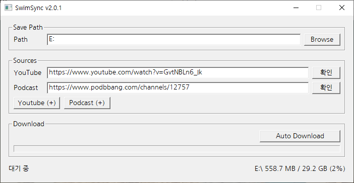

# SwimSync

수영장에서 쓰는 MP3 플레이어에 동기화하기 위해 만든 Windows용 미디어 다운로더입니다.

## 기능

- YouTube 영상을 MP3로 자동 추출
- 팟빵(Podbbang) 팟캐스트 채널의 최근 에피소드 자동 다운로드
- 여러 개의 YouTube/팟캐스트 소스를 등록해서 한 번에 관리
- 앱이 켜져 있는 동안 1시간마다 자동으로 최신 상태 확인 및 다운로드
- 실행할 때마다 최신 버전인지 자동으로 확인하고, 구버전이면 스스로 업데이트

## 다운로드 및 실행

이 저장소 루트의 `SwimSync-v{버전}.zip`을 받아 압축을 풀고 `SwimSync.exe`를 실행하면 됩니다. 별도 설치 과정은 없습니다.

- `yt-dlp.exe`, `ffmpeg.exe`/`ffprobe.exe`는 없으면 최초 실행 시 자동으로 다운로드합니다 (ffmpeg는 용량이 커서 시간이 걸릴 수 있습니다).
- 실행할 때마다 이 저장소의 최신 버전을 자동으로 확인하고, 구버전이면 `dist/SwimSync-latest.zip`을 받아 스스로 교체·재시작합니다. 인터넷에 연결되어 있지 않거나 최신 버전을 확인할 수 없으면 실행이 차단됩니다.

## 참고

이 저장소에는 빌드된 배포본만 올라옵니다. (Win32/C++로 작성)
